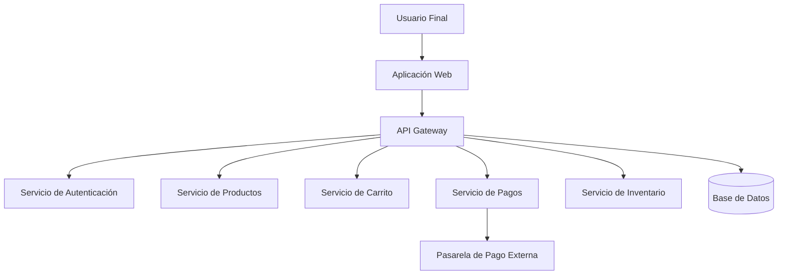
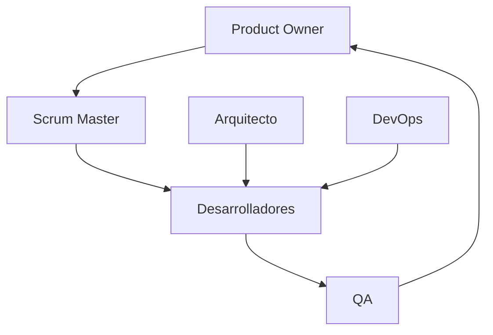
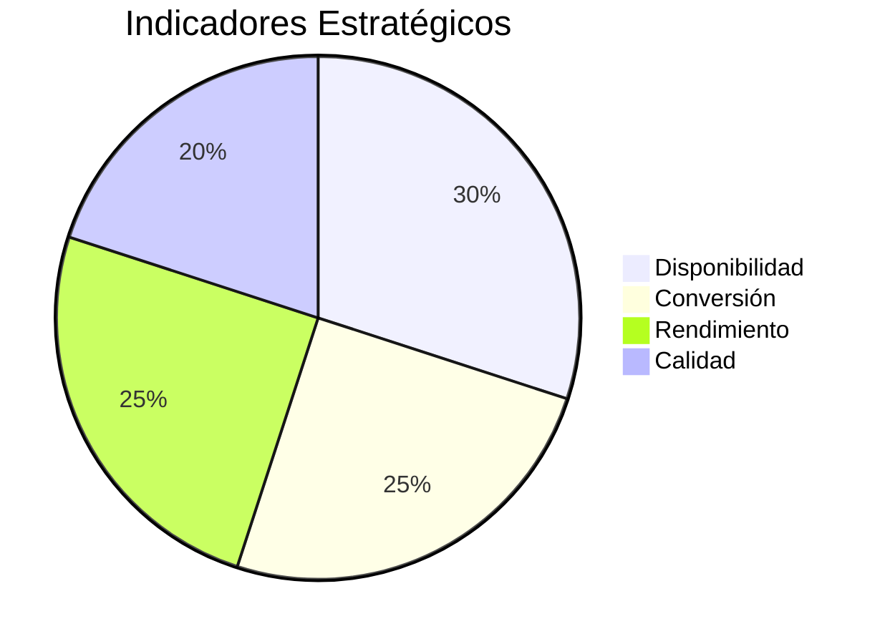
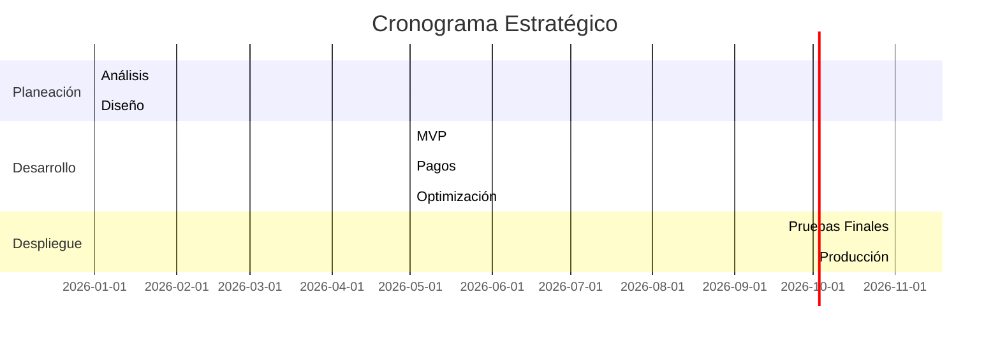

# DISEÑO Y APLICACIÓN DE UN MODELO HÍBRIDO DE CICLO DE VIDA DEL SOFTWARE
## Plataforma E-Commerce Empresarial para PYME en Crecimiento

**Programa:** Ingeniería de Sistemas  
**Asignatura:** Ingeniería de Procesos del Software  
**Nivel:** Pregrado  
**Tipo de Proyecto:** Diseño y Aplicación de un Modelo de Ciclo de Vida del Software  
**Integrantes:** Valentina Cortés Alarcón y Brayam Manuel Santafe Barreto  

---

# 1. Introducción

El presente documento desarrolla el análisis crítico, selección metodológica y aplicación práctica de un modelo híbrido de Ciclo de Vida del Software (SDLC) para el diseño de una plataforma de comercio electrónico orientada a una PYME en crecimiento.

El proyecto responde a un contexto empresarial caracterizado por:

- Alta competitividad digital.
- Necesidad de rápida entrada al mercado.
- Restricciones presupuestarias iniciales.
- Escalabilidad progresiva.
- Gestión rigurosa de riesgos técnicos y financieros.

Se propone un modelo híbrido que integra:

- Desarrollo Incremental.
- Marco Ágil Scrum.
- Principios de verificación y validación del Modelo en V.

---

# 2. Marco Teórico y Referencias Metodológicas

## 2.1 Modelo en Cascada (Waterfall)

Modelo secuencial tradicional donde cada fase debe finalizar antes de iniciar la siguiente.

**Referencias:** IEEE 12207, Winston Royce (1970)

**Herramientas utilizadas en entornos empresariales:**
- Microsoft Project
- Oracle Primavera
- Jira (configuración tradicional)

**Ventajas:**
- Alta documentación.
- Control formal.
- Claridad contractual.

**Desventajas:**
- Baja flexibilidad.
- Alta vulnerabilidad ante cambios.

**Uso recomendado:** Proyectos regulados con requisitos completamente definidos.

---

## 2.2 Modelo en V

Extensión del modelo en cascada que vincula cada fase de desarrollo con su respectiva fase de prueba.

**Herramientas empresariales:**
- IBM Engineering Lifecycle Management
- Siemens Polarion ALM

**Ventajas:**
- Aseguramiento estructurado de calidad.
- Reducción de defectos críticos.

**Uso recomendado:** Sistemas médicos, financieros o de alta criticidad.

---

## 2.3 Modelo Espiral

Propuesto por Barry Boehm (1986), enfocado en gestión iterativa de riesgos.

**Herramientas:**
- Jira
- Azure DevOps

**Ventajas:**
- Gestión explícita de riesgos.
- Prototipado progresivo.

**Desventajas:**
- Alto costo.
- Complejidad administrativa.

**Uso recomendado:** Proyectos con alta incertidumbre tecnológica.

---

## 2.4 Modelo Incremental

Construcción progresiva por módulos funcionales independientes.

**Herramientas:**
- GitHub
- GitLab
- Jira

**Ventajas:**
- Entrega temprana de valor.
- Escalabilidad progresiva.
- Reducción de riesgo financiero.

**Uso recomendado:** Plataformas digitales y sistemas empresariales escalables.

---

## 2.5 Scrum (Marco Ágil)

Marco iterativo basado en sprints de 2 a 4 semanas.

**Referencias oficiales:**
- scrum.org
- scrumalliance.org

**Herramientas:**
- Jira
- Azure DevOps
- ClickUp
- Monday.com

**Ventajas:**
- Alta adaptabilidad.
- Retroalimentación continua.
- Enfoque en valor de negocio.

---

# 3. Matriz Comparativa

| Criterio | Cascada | Modelo V | Espiral | Incremental | Scrum |
|-----------|----------|-----------|----------|--------------|--------|
| Flexibilidad | Baja | Baja | Media | Media | Alta |
| Gestión de Riesgo | Baja | Media | Alta | Media | Media |
| Documentación | Alta | Alta | Alta | Media | Baja-Media |
| Participación Usuario | Baja | Baja | Media | Media | Alta |
| Time-to-Market | Lento | Medio | Medio | Rápido | Muy Rápido |

Conclusión: Ningún modelo por sí solo satisface completamente el contexto empresarial del proyecto.

---

# 4. Justificación del Modelo Híbrido

La plataforma e-commerce presenta:

- Riesgos financieros (pagos electrónicos).
- Necesidad de velocidad de despliegue.
- Requerimientos evolutivos.
- Restricción presupuestaria inicial.
- Necesidad de control de calidad en módulos críticos.

Por lo tanto:

- Incremental → Modularidad y crecimiento progresivo.
- Scrum → Entregas rápidas y adaptación.
- Modelo V → Pruebas estructuradas en pagos y autenticación.

---

# 5. Modelo Híbrido Propuesto

---

# 6. Fases del Proyecto

## 6.1 Análisis y Factibilidad
- Documento de requisitos.
- Estudio de viabilidad técnica y financiera.
- Identificación de riesgos iniciales.

## 6.2 Diseño Arquitectónico
- Arquitectura basada en microservicios.
- Modelo de datos.
- Estrategia de seguridad.
- Diseño de APIs.

## 6.3 Desarrollo por Incrementos
Cada incremento incluye:
- Planificación de Sprint.
- Desarrollo.
- Pruebas unitarias.
- Pruebas de integración.
- Revisión con stakeholders.

---

# 7. Arquitectura del Sistema

**Características clave:**

- Arquitectura desacoplada.
- Escalabilidad horizontal.
- Seguridad robusta.
- Integración certificada de pagos.
- Soporte para integración continua (CI/CD).

---

# 8. Roles y Responsabilidades

---

# 9. Gestión de Riesgos

| Riesgo | Probabilidad | Impacto | Mitigación |
|--------|-------------|----------|------------|
| Fallo en pagos | Media | Alto | Pruebas sandbox + monitoreo |
| Ataques de seguridad | Media | Crítico | Escaneo continuo |
| Retrasos en entregas | Media | Medio | Control de velocidad |
| Sobrecarga del sistema | Alta | Alto | Escalamiento automático |

---

# 10. Métricas y KPIs

- Disponibilidad > 99.5%
- Tiempo de carga < 2.5 segundos
- Tasa de conversión > 3%
- Defectos críticos por sprint < 2
- Velocidad estable por sprint

---

# 11. Roadmap Estratégico

---

# 12. Estrategia de Mantenimiento

Se contempla:

- Mantenimiento correctivo.
- Mantenimiento evolutivo.
- Mantenimiento adaptativo.
- Mantenimiento perfectivo.

Enfoque DevOps para soporte continuo.

---

# 13. Conclusión General

El modelo híbrido propuesto permite:

- Reducir riesgos financieros.
- Acelerar la entrada al mercado.
- Garantizar calidad en componentes críticos.
- Escalar progresivamente.
- Integrar rigor académico con prácticas empresariales reales.